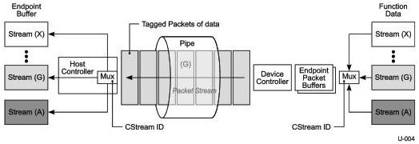

USB 3.1 Enhanced SuperSpeed Data Flow Model

Streams are managed between the host and a device using the Stream Protocol. Each Stream is assigned a Stream ID (SID).

The Stream Protocol defines a handshake, which allows the device or host to establish the Current Stream (CStream) ID associated with an endpoint. The host uses the CStream ID to select the command or operation-specific Endpoint Buffer(s) that will be used for subsequent data transfers on the pipe (see Figure 4-3). The device uses the CStream ID to select the Function Data buffer(s) that will be used.

Figure 4-3. Enhanced SuperSpeed IN Stream Example

The example in Figure 4-3 represents an IN Bulk pipe, where a large number of Streams have been established. Associated with each Stream in host memory is one or more Endpoint Buffers to receive the Stream data. In the device, there is a corresponding command or operation-specific Function Data to be transmitted to the host.

When the device has data available for a specific Stream (G in this example), it issues an ERDY tagged with the CStream ID, and the host will begin issuing IN ACK TP's to the device that is tagged with the CStream ID. The device will respond by returning DPs that contain the Function Data associated with the CStream ID that is also tagged with the CStream ID. When the host receives the data, it uses the CStream ID to select the set of Endpoint Buffers that will receive the data.

When the Function Data is exhausted, the device terminates the Stream (refer to Section 8.12.1.4). The host is also allowed to terminate the Stream if it runs out of Endpoint Buffer space.

Streams may be used, for example, to support out-of-order data transfers required for mass storage device command queuing.

A standard bulk endpoint has a single set of Endpoint Buffers associated with it. Streams extend the number of host buffers accessible by an endpoint from 1 to up to 65533. There is a 1:1 mapping between a host buffer and a Stream ID.

Device Class defined methods are used for coordinating the Stream IDs that are used by the host to select Endpoint Buffers and the device to select Function Data associated with a particular Stream. Typically this is done via an out-of-band mechanism (e.g., another endpoint) that is used to pass the list of valid Stream IDs between the host and the device.

The selection of the Current Stream may be initiated by the host or the device and, in either case, the Stream Protocol provides a method for a selection to be rejected. For example, the host may reject a Stream selection initiated by the device if it has no Endpoint Buffers available for it. Or the

4-11