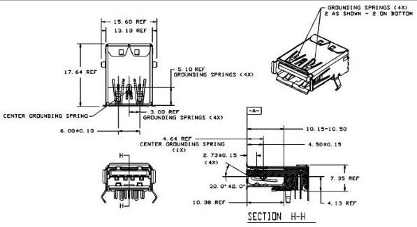

Mechanical

made to minimize impedance discontinuity of the top connector in the stack because of its long electrical path. Attention to the high speed electrical design of USB 3.1 Standard-A connectors is required. In addition to minimizing the connector impedance discontinuities, crosstalk between the SuperSpeed differential signal pairs and USB 2.0 D+/D- pair should also be minimized.

- The receptacle connector should have a back-shield to ensure that the receptacle connector is fully enclosed. The USB 3.1 receptacle should also make good contact to the PCB ground by providing sufficient number of ground tabs to ensure a low impedance path to PCB ground. The USB 3.1 receptacle connector should have a robust mating interface to the shield of the USB 3.1 plug when it is inserted. Previous versions of this specification required providing a grounding spring tab in the middle of the side closest to the USB SuperSpeed signal contacts and grounding springs on both sides of the shell for USB 3.0 Standard-A receptacles. New designs shall have three grounding spring tabs on the side closest to the USB SuperSpeed signal contacts, two grounding spring tabs on the side opposite the USB SuperSpeed signal contacts, and a grounding spring on both sides of the shell of the USB 3.1 Standard-A receptacle. See Figure 5-2.

Continued on next page

5-5