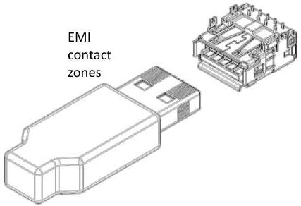
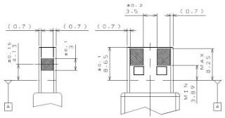

Mechanical

BOTTOM VIEW (SIDE OPPOSITE SUPERSPEED CONTACTS)

USB 3.1 PLUG

USB 3.1 PD PLUG

Figure 5-2. Example USB 3.1 Standard-A Receptacle with Grounding Springs and Required contact zones on the Standard-A Plug.

5-9