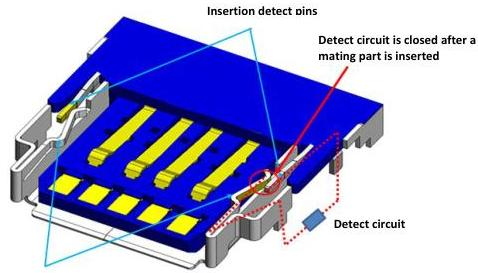
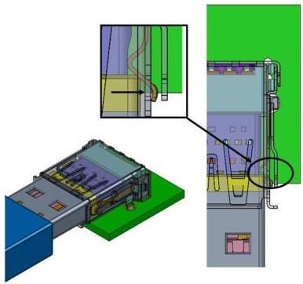

Universal Serial Bus 3.1 Specification, Revision 1.0

Spring fingers on the side of
receptacle shell are EMI functional

Figure 5-3. Example USB 3.1 Standard-A Mid-Mount Receptacles with Insertion Detect

5-10