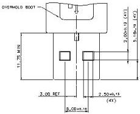
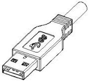
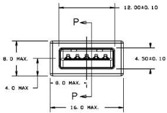
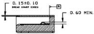

Mechanical

SECTION P-P

NOTES:

1) NON-DIMENSIONED GEOMETRY FOR REFERENCE ONLY,
SUBJECT TO CHANGE

2) DRAWING FOR MATING INTERFACE DIMENSIONS ONLY,
VIEWS MAY NOT SHOW REALISTIC MANUFACTURING CONDITION.

Continued on next page

5-11